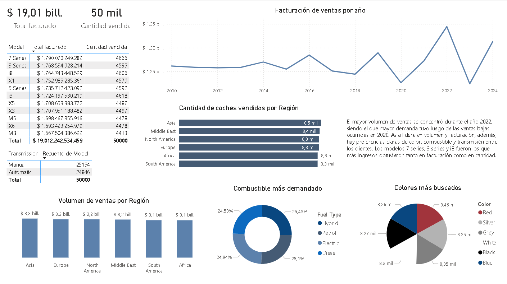

# Analisis-ventas-BMW
Análisis de datos sobre las ventas de vehículos BMW, evaluando la evolución anual del volumen y facturación de mercado por modelo y región, además de analizar el impacto del tipo de transmisión y combustible sobre la demanda.

# Dashboard de ventas - Power BI
Proyecto de análisis de ventas de vehículos BMW desarrollado con SQL y Power BI, enfocado en entender la facturación anual, comprender las preferencias de los clientes y las regiones que más demandan la marca.

---

## Objetivo del proyecto

Analizar los datos del proyecto para identificar:
- Tendencias anuales por facturación
- Modelos con mayor impacto en ingresos y volumen
- Que tipo de combustible, transmisión y colores buscan los clientes
- Regiones que más consumen la marca

---

## Estructura del proyecto

El repositorio contiene los siguientes archivos:

- `dashboardBMW.pbix` → Archivo principal del dashboard en Power BI.
- `consultas.sql` → Consultas SQL utilizadas para el análisis exploratorio.
- `create_table.sql` → Script SQL para la creación de la tabla de bmw_sales
- `BMW.csv` → Dataset utilizado para el análisis y visualización.
- `/images/` → Capturas del dashboard para visualización rápida.

---

## Dataset

El dataset contiene información de ventas con los siguientes campos:
- `Model`
- `Year`
- `Region`
- `Color`
- `Fuel_Type`
- `Transmission`
- `Engine_Size_L`
- `Price_USD`
- `Sales_Volume`
- `Sales_Classification`

---

## Métricas principales

- Facturación total
- Cantidad de vehiculos vendidos
- Variación anual de la facturación
- Volumen de ventas por región
- Facturación por cantidad de modelos

---

##  Principales insights

- El año 2022 fue el que mayor volumen de ventas obtuvo luego de las ventas bajas ocurridas durante 2020
- Asia es la región con más consumidores, lidera en cantidad y facturación
- Hay una leve diferencia entre los tipos de transmisiones, pero refleja las preferencia de los clientes
- Los modelos 7 series, 3 series y i8 fueron los más demandados y los que más ingresos generaron

---

## Dashboard

Vista general del dashboard:

---

## Herramientas utilizadas

- SQLite
- Power BI
- Dataset Kaggle 

---

## Notas

Proyecto realizado con fines de práctica en análisis de datos.

